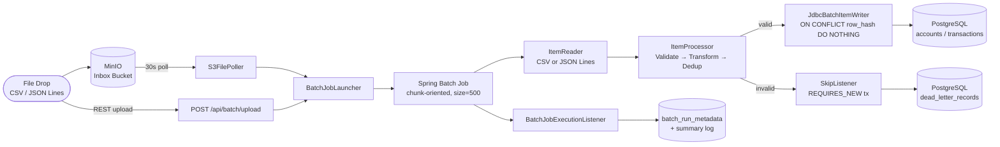

# BulkFlow — Resilient Batch Ingestion Pipeline


---

## What This Is

Most bulk import pipelines fail in one of two ways: they drop bad data silently with no trace, or they block 100,000 valid records because 12 are malformed. BulkFlow is a production-shaped batch ingestion engine that does neither — invalid records are isolated into a queryable, reprocessable dead-letter store while valid records proceed to the database uninterrupted.

The core demo: a batch of **10,000 records with 12 intentional errors** produces exactly this output in the logs:

```
╔══════════════════════════════════════════════════════════╗
║              BULKFLOW — BATCH COMPLETE                   ║
╠══════════════════════════════════════════════════════════╣
║  Batch ID  : batch-a3f2b1c9-...                          ║
║  Feed Type : accounts                                    ║
║  Total     : 10,000 records                              ║
║  Succeeded : 9,988                                       ║
║  Failed    : 12                                          ║
╠══════════════════════════════════════════════════════════╣
║  Failure Breakdown:                                      ║
║    invalid_email          : 7                            ║
║    missing_field          : 3                            ║
║    duplicate_in_batch     : 2                            ║
╚══════════════════════════════════════════════════════════╝
```

That one output is the point of the project. The 12 failed records are queryable via `GET /api/dead-letter`, reprocessable after a fix, and linked to their originating batch by ID.

---

## Why This Exists

Bulk onboarding is everywhere in fintech, healthcare, and HR — account enrollment from a partner bank, member import from a benefits platform, transaction reconciliation from a payment processor. These pipelines are deceptively hard to build correctly: the happy path is straightforward, but production systems require partial-failure handling, idempotent re-runs, and audit trails for every dropped record.

I built a bulk enrollment platform in production (high-volume record ingestion with validation, partial-failure handling, and retry logic) and wanted a portfolio project that proves this pattern publicly — with real Spring Batch job structure, real dead-letter design, and real observability, not toy examples.

The other three projects in this portfolio (Tickera for event-driven microservices, LogSense for AI agent tooling, TxSentry for Python observability) prove real-time and AI-native patterns. BulkFlow fills the remaining gap: **high-throughput batch processing at scale with the engineering story fully documented**.

---

## Architecture



**Full diagram and component descriptions:** [docs/architecture.md](docs/architecture.md)

---

## Core Capabilities

- **Two feed types**: CSV (accounts) and JSON Lines (transactions), configurable by filename pattern
- **Chunk-oriented processing**: Spring Batch chunk size 500 — ~200KB heap per chunk, ~100k rows/min throughput
- **Schema validation**: required fields, email/phone format (regex), enum membership (status, currency, transaction type), numeric constraints — all with structured reason codes
- **Business rule validation**: intra-batch duplicate detection via ConcurrentHashMap per batch run
- **Failure isolation**: Spring Batch `skip(ValidationException)` with `skipLimit=MAX_VALUE` — a batch with 12 bad records never fails because of those 12
- **Dead-letter store**: every skipped record captured with `raw_record`, `failure_reason`, `failure_field`, `batch_id` — queryable and reprocessable via REST API
- **Idempotent load**: SHA-256 hash of normalized record content → `ON CONFLICT (row_hash) DO NOTHING` — same file can be dropped twice safely
- **Retry with backoff**: transient DB failures retry 3× with exponential backoff; validation failures never auto-retry
- **Observability**: structured log per batch with MDC context (`batch_id`, `feed_type`), `batch_run_metadata` table, Prometheus metrics via Actuator, formatted summary box at job completion
- **REST API**: batch upload trigger, metrics summary, paginated batch history, dead-letter browser, reprocess workflow

---

## Quick Start

**Prerequisites:** Docker, Java 17, Python 3 (for sample data generator)

```bash
# Clone and start infrastructure
git clone https://github.com/pavankumarale/bulkflow
cd bulkflow
make up

# Build the application
./mvnw clean package -DskipTests

# Run the application (in a separate terminal)
java -jar target/bulkflow-*.jar

# Generate 10,000 sample accounts (9,988 valid + 12 bad) and run the demo
make demo
```

The demo script:
1. Generates `sample-data/accounts_bulk.csv` via `scripts/generate_sample_data.py`
2. Uploads the file via `POST /api/batch/upload`
3. Polls `GET /api/metrics/batches/{batchId}` until completion
4. Prints the metrics summary and failure breakdown

Watch the application logs for the formatted batch summary box.

---

## API Reference

| Endpoint | Method | Description |
|---|---|---|
| `/api/batch/upload` | POST | Upload a file and launch a batch job. Form params: `file`, `feedType` |
| `/api/metrics/summary` | GET | Overall success rate across all completed batches |
| `/api/metrics/batches` | GET | Paginated batch history. Query: `feedType`, `page`, `size` |
| `/api/metrics/batches/{batchId}` | GET | Single batch detail with counts and failure breakdown |
| `/api/dead-letter` | GET | Browse dead-lettered records. Query: `batchId`, `feedType`, `page`, `size` |
| `/api/dead-letter/{batchId}/breakdown` | GET | Failure reason → count for a batch |
| `/api/dead-letter/{batchId}/reprocess` | POST | Mark records as reprocessed. Query: `reprocessBatchId` |
| `/actuator/health` | GET | Spring Boot health check |
| `/actuator/prometheus` | GET | Prometheus metrics endpoint |

---

## Project Structure

```
bulkflow/
├── src/main/java/com/bulkflow/
│   ├── ingestion/         # S3FilePoller, FeedType
│   ├── validation/        # AccountValidator, TransactionValidator, DuplicateDetector
│   ├── transform/         # AccountTransformer, TransactionTransformer (hash computation)
│   ├── batch/             # Job/Step config, ItemProcessors, SkipRecordListener
│   ├── deadletter/        # DeadLetterService, repository, REST controller
│   ├── observability/     # BatchMetricsService, metadata repository, MetricsController
│   ├── api/               # BatchTriggerController
│   ├── model/             # AccountRecord, TransactionRecord, DeadLetterRecord, BatchRunMetadata
│   └── config/            # BulkFlowProperties, MinIOConfig
├── src/main/resources/
│   ├── application.yml
│   └── db/migration/      # V1 (domain schema), V2 (Spring Batch tables)
├── src/test/java/com/bulkflow/
│   ├── unit/              # AccountValidatorTest, AccountTransformerTest, TransactionValidatorTest
│   └── integration/       # AccountBatchJobIntegrationTest (Testcontainers Postgres)
├── docs/
│   ├── architecture.md    # Mermaid diagram + component descriptions
│   ├── LLD.md             # Chunk size, skip/retry, dead-letter, idempotency, concurrency
│   └── adr/
│       ├── 0001-batch-load-strategy.md
│       ├── 0002-idempotency-approach.md
│       └── 0003-failure-isolation-design.md
├── sample-data/
│   ├── accounts_valid.csv           # 20 clean rows for smoke tests
│   ├── accounts_with_errors.csv     # 20 rows with 12 intentional failures
│   └── transactions_valid.jsonl     # 20 JSON Lines transactions
├── scripts/
│   ├── generate_sample_data.py      # Generates 10k accounts + 5k transactions
│   └── demo.sh                      # End-to-end demo: upload → wait → summary
├── docker-compose.yml               # Postgres + MinIO + optional app
├── Makefile                         # make up | make demo | make test | make metrics
├── Dockerfile
└── .github/workflows/ci.yml
```

---

## Engineering Decisions

| Decision | ADR |
|---|---|
| Why batched INSERT over COPY or staging-table MERGE | [ADR 0001](docs/adr/0001-batch-load-strategy.md) |
| Why SHA-256 row hash for idempotency | [ADR 0002](docs/adr/0002-idempotency-approach.md) |
| Skip policy, dead-letter design, retry classification | [ADR 0003](docs/adr/0003-failure-isolation-design.md) |

Low-level design details (chunk size derivation, field-level dead-letter schema rationale, concurrency model): [docs/LLD.md](docs/LLD.md)

---

## Testing Strategy

**Unit tests** (`src/test/java/.../unit/`):
- `AccountValidatorTest`: valid record passes; missing required fields throw `missing_field`; 5 invalid email formats; invalid status/currency/negative credit limit; null optional fields pass
- `TransactionValidatorTest`: missing fields; zero/negative amount; invalid transaction type; all 6 valid types accepted
- `AccountTransformerTest`: email lowercased; names capitalized; status/currency uppercased; phone whitespace stripped; `row_hash` is 64-char hex; same input → same hash; different inputs → different hashes; null status/currency defaults

**Integration tests** (`src/test/java/.../integration/`):
- `AccountBatchJobIntegrationTest`: launches a full Spring Batch job against Testcontainers Postgres using the intentionally malformed sample file; asserts exact valid record count loaded, ≥4 dead-letter records, all dead-letter records have non-blank reason codes
- Idempotency test: runs the same file twice, asserts exactly 1 row in the target table
- All-invalid batch: asserts 0 rows loaded and >0 dead-letter records

---

## What I'd Add Next

- **Parallel step partitioning**: partition source files by row range, process N partitions concurrently with separate `DuplicateDetector` instances per partition — linear throughput scaling without concurrency complexity in the intra-partition path
- **Kafka ingestion source**: replace the MinIO poller with a Kafka `ItemReader` for streaming batch trigger patterns (micro-batch on topic offset)
- **Prometheus + Grafana dashboard**: batch success rate, p95 duration, dead-letter rate over time — reusing the TxSentry dashboard pattern from my observability project
- **Testcontainers MinIO in CI**: integration tests currently use Testcontainers for Postgres; add MinIO container for full end-to-end ingestion tests including the S3 poller path
