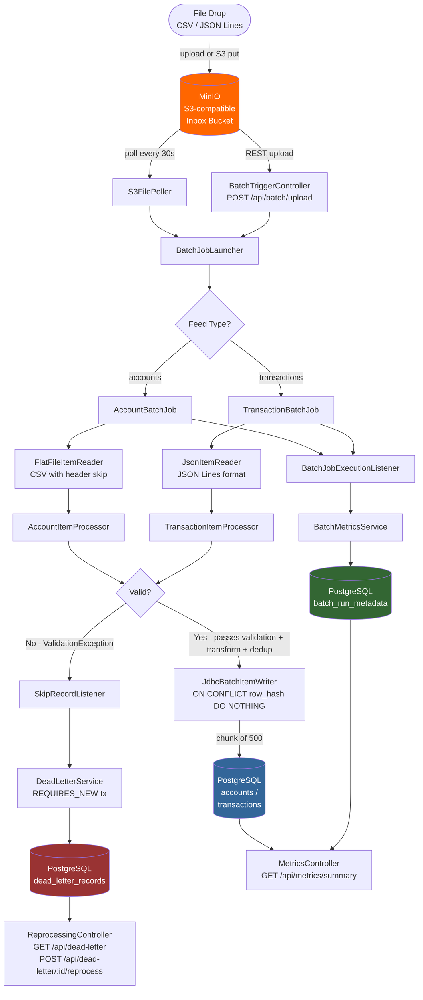

# BulkFlow — Architecture Overview

## Data Flow Diagram

## Component Descriptions

### Ingestion Layer

**S3FilePoller** (`ingestion/S3FilePoller.java`)
Scheduled poller (default 30s interval) that lists objects in the MinIO inbox bucket, downloads each file to a local temp path, determines the feed type from the filename, and delegates to `BatchJobLauncher`. After successful job launch, moves the file to the `bulkflow-processed` bucket. Configurable via `bulkflow.poller.enabled` and `bulkflow.poller.interval-ms`.

**BatchTriggerController** (`api/BatchTriggerController.java`)
REST endpoint (`POST /api/batch/upload`) that accepts a multipart file upload and `feedType` parameter. Writes the upload to a temp file and delegates to `BatchJobLauncher`. Useful for local development and one-off manual triggers without MinIO.

**FeedType** (`ingestion/FeedType.java`)
Enum with `ACCOUNTS` and `TRANSACTIONS` values. `FeedType.fromFilename()` infers the type by checking whether the filename contains "account" or "transaction" (case-insensitive).

### Batch Processing Layer

**BatchJobLauncher** (`batch/BatchJobLauncher.java`)
Entry point for all batch execution. Assigns a UUID-based `batch_id`, sets MDC logging context, calls `BatchMetricsService.recordBatchStart()`, builds `JobParameters`, and calls `jobLauncher.run()`. The `batch_id` flows through `JobParameters` into every component of the job.

**AccountBatchJob / TransactionBatchJob** (`batch/AccountJobConfig.java`, `TransactionJobConfig.java`)
Spring Batch `Job` beans, each composed of a single `Step`. The step is a chunk-oriented tasklet:
- **Reader**: `FlatFileItemReader` (CSV, header skip) for accounts; `JsonItemReader` (JSON Lines) for transactions
- **Processor**: validates → transforms → deduplicates
- **Writer**: `JdbcBatchItemWriter` with `ON CONFLICT (row_hash) DO NOTHING`
- **Fault tolerance**: `skip(ValidationException)` with `skipLimit=MAX_VALUE`; `retry(TransientDataAccessException)` with `retryLimit=3`

### Validation & Transform Layer

**AccountValidator / TransactionValidator** (`validation/`)
Pure validation components with no side effects. Validate required fields, email/phone format (regex), enum membership (status, currency, transaction type), and numeric constraints. Throw `ValidationException` with a structured `FailureReason` code and the field name that failed.

**DuplicateDetector** (`validation/DuplicateDetector.java`)
In-memory `ConcurrentHashMap`-backed set tracking natural keys seen within a single batch run. Reset via `@BeforeStep`. Catches intra-batch duplicates (same `account_id` appearing twice in one file) that `ON CONFLICT` alone would not isolate — they'd both try to write and the second would silently skip without a dead-letter entry.

**AccountTransformer / TransactionTransformer** (`transform/`)
Post-validation normalization: lowercase email, capitalize names, uppercase enums, strip whitespace from phone numbers, default null optional fields. Computes SHA-256 `row_hash` after normalization so the hash is stable across cosmetic variations in source data.

### Failure Isolation Layer

**SkipRecordListener** (`batch/SkipRecordListener.java`)
Spring Batch `SkipListener` wired into both job steps. Captures the raw record and `ValidationException` metadata on each skip event and delegates to `DeadLetterService`. Handles skips in all three phases: read (parse failures), process (validation failures), and write (constraint violations).

**DeadLetterService** (`deadletter/DeadLetterService.java`)
Writes dead-letter records using `@Transactional(propagation = REQUIRES_NEW)` — a separate transaction from the batch chunk. This guarantees dead-letter writes commit even when the surrounding chunk rolls back on transient errors. Also provides `getFailureBreakdown()` (aggregated reason code → count per batch) and `markReprocessed()` for the reprocess workflow.

### Observability Layer

**BatchMetricsService** (`observability/BatchMetricsService.java`)
Called by `BatchJobExecutionListener` at job start and completion. Writes/updates `batch_run_metadata` rows with counts, duration, status, and the failure breakdown JSON. Emits a structured log at INFO level and prints a formatted summary box to logs at job completion — this box is the core demo output.

**MetricsController** (`observability/MetricsController.java`)
`GET /api/metrics/summary` — overall success rate across all completed batches.
`GET /api/metrics/batches` — paginated batch history with filtering by feed type.
`GET /api/metrics/batches/{batchId}` — single batch detail.

**ReprocessingController** (`deadletter/ReprocessingController.java`)
`GET /api/dead-letter` — browse dead-lettered records by batch or feed type.
`GET /api/dead-letter/{batchId}/breakdown` — failure reason → count for a specific batch.
`POST /api/dead-letter/{batchId}/reprocess` — mark records as reprocessed and link to a new batch ID.

## Data Flow Walkthrough

1. An operator drops `accounts_bulk.csv` into the MinIO `bulkflow-inbox` bucket (or POSTs it to `/api/batch/upload`)
2. `S3FilePoller` detects the new object on its next 30s poll cycle, downloads it to `/tmp`, determines `FeedType.ACCOUNTS` from the filename, and calls `BatchJobLauncher.launch()`
3. `BatchJobLauncher` assigns `batch-{uuid}` as the `batchId`, sets MDC logging context, records the batch start in `batch_run_metadata`, and starts the Spring Batch `accountBatchJob`
4. Spring Batch runs the `accountIngestStep` as a chunk-oriented tasklet. `FlatFileItemReader` reads 500 records at a time (one chunk)
5. For each record in a chunk, `AccountItemProcessor` calls `AccountValidator.validate()`. If validation fails, a `ValidationException` is thrown with a structured reason code
6. Spring Batch's skip policy intercepts the `ValidationException`. `SkipRecordListener.onSkipInProcess()` is called, which writes the raw record + reason code to `dead_letter_records` in a `REQUIRES_NEW` transaction
7. Valid records continue to `AccountTransformer`, which normalizes fields and computes `row_hash`
8. At the end of each chunk, `JdbcBatchItemWriter` executes one batched INSERT for all 500 (or fewer) valid records. `ON CONFLICT (row_hash) DO NOTHING` silently skips any records already in the table
9. After all chunks complete, `BatchJobExecutionListener.afterJob()` calls `BatchMetricsService.recordBatchComplete()`, which aggregates counts from Spring Batch's step execution context, fetches failure breakdown from the dead-letter table, and emits the summary box log entry
10. The source file is moved from `bulkflow-inbox` to `bulkflow-processed` and the temp file is deleted

## Failure Isolation Story

The core value of BulkFlow is that **a batch of 10,000 records with 12 bad rows produces exactly 9,988 successful writes and 12 queryable, reprocessable dead-letter entries** — not a failed job, not a partially-loaded table with missing rows and no explanation.

The isolation is enforced at two layers:
- **Spring Batch skip policy**: `ValidationException` is classified as skippable; the chunk continues after isolating the bad record
- **REQUIRES_NEW dead-letter transaction**: The dead-letter write happens in a separate transaction that commits independently of the batch chunk, so bad records are captured even during retry scenarios
